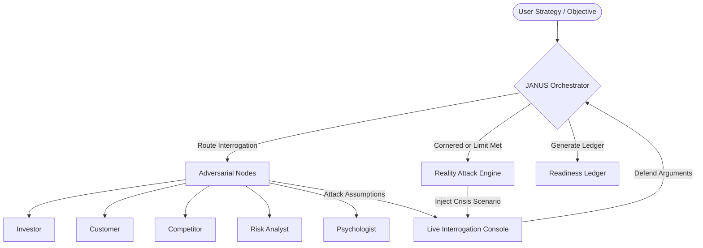

# Janus AI — Strategic Stress-Testing Platform

> **"Expose your strategic blind spots before reality does."**

Janus AI is an adversarial strategic advisory engine. Unlike traditional planning tools that assist in path creation, Janus is designed to **stress test, interrogate, and challenge** strategic assumptions. It simulates hostile market forces, uncovers logical blind spots, and subjects strategic decisions to a panel of expert AI adversarial personas.

---

## 🔮 Core Capabilities

*   **Live Adversarial Interrogation**: Real-time strategy cross-examinations where users defend their thesis against aggressive, hyper-logical AI panels.
*   **Persona-Driven Challenges**: Probes narrow strategy vectors (financial viability, product-market fit, competitor maneuvers, operational single-points-of-failure, and cognitive/emotional biases).
*   **Reality Attack Engine**: Simulates unexpected, customized operational catastrophes (e.g. key supplier bankruptcy, IP leakage, copycat competitor pricing) midway through defense to test execution agility.
*   **Decision Readiness Ledger**: Compiles transcripts into a quantitative audit report containing Readiness/Confidence Scores (0-100), structured vulnerability lists, and actionable remediation guidelines.

---

## 🧩 The Adversarial Node Matrix

Janus runs a panel of five distinct, specialized expert nodes:

| Node | Icon | Core Focus | Attack Vector |
| :--- | :---: | :--- | :--- |
| **Investor** | 📈 | Capital & Runways | Financial assumptions, cash flow leakage, profitability metrics. |
| **Customer** | 👥 | Product-Market Fit | Probes real demand, mock utility, value propositions. |
| **Competitor** | ⚔️ | Moats & Pricing | Threatens copycat launches, margin wars, lack of differentiation. |
| **Risk Analyst** | 🛡️ | Operations & Assets | Operational bottlenecks, supply chain single points of failure. |
| **Psychologist** | 🧠 | Biases & Delusions | Human cognitive bias, ego-driven assumptions, wishful thinking. |

---

## 🏗️ System Architecture



---

## 🛠️ Technology Stack

*   **Frontend & Routing**: [Next.js 15.4.4](https://nextjs.org/) + [React 19](https://react.dev/) (App Router, Server API Endpoints)
*   **AI Engine**: [Google GenAI SDK](https://github.com/google/generative-ai-js) interfacing with `gemini-2.5-flash` using structured JSON output configurations.
*   **Database & Schema**: [Prisma ORM](https://www.prisma.io/) + [SQLite](https://www.sqlite.org/) (`better-sqlite3` adapter) for lightweight local transcript and report storage.
*   **Design & Styling**: [Tailwind CSS v4](https://tailwindcss.com/) + [Lucide Icons](https://lucide.dev/) for a premium dark-themed cybergrid interface.

---

## 🚀 Getting Started

### 1. Prerequisites
Ensure you have **Node.js** (v18+) and **npm** installed.

### 2. Installation
Clone the repository, navigate into the directory, and install dependencies:
```bash
git clone https://github.com/Aadi-tries/janus-ai.git
cd janus-ai
npm install
```

### 3. Environment Setup
Create a `.env.local` file in the root directory:
```env
GEMINI_API_KEY=your_gemini_api_key_here
DATABASE_URL="file:./dev.db"
```

### 4. Database Initialization
Generate the Prisma client and push the schema to SQLite:
```bash
npx prisma generate
npx prisma db push
```

### 5. Running the Application
Launch the local development server:
```bash
npm run dev
```
Open [http://localhost:3000](http://localhost:3000) in your browser to start stress-testing your decisions.
